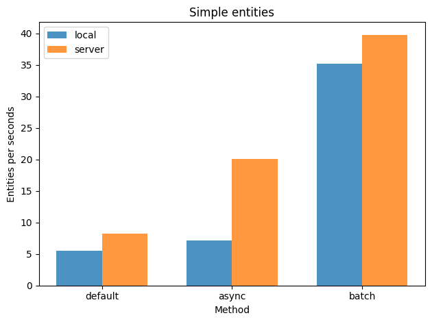
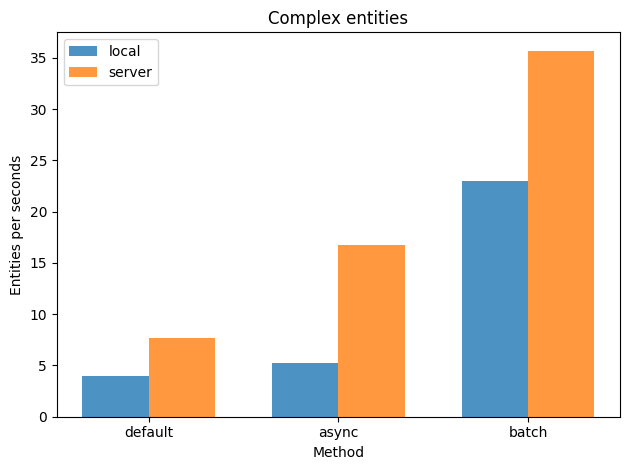

# BatchIngestion Extension

The BatchIngestion extension provides a faster and more efficient way to add or edit Wikibase entities. With this extension, you can perform multiple entity creation or modification operations with a single request, instead of making individual requests for each entity. This can save you time and reduce the workload on your server.

## Features

- Add or edit Wikibase entities in bulk
- Faster and more efficient than the base API
<!-- - Simple and easy-to-use interface -->

## Requirements

- MediaWiki
- Wikibase extension

## Installation

1. Clone or download this repository to your MediaWiki `extensions` directory.

2. Rename the directory to `BatchIngestion`.

3. Add the following line to your `LocalSettings.php` file:

   ```php
   wfLoadExtension( 'BatchIngestion' );
   ```

4. Run the `update.php` script to update your MediaWiki database:

   ```sh
   php maintenance/update.php
   ```

## Authorization

You can set the group of allowed users in the `extension.json` file, by tweaking the `BatchIngestionAllowedGroup` variable. By default, it is set on `bureaucrat`.

## Usage

To use BatchIngestion, send a POST request to the API endpoint `/w/rest.php/BatchIngestion/v0/batchcreate` with the information of the entities you want to add or edit in JSON format. The entities parameter should contain an array of the Wikibase entities to add or edit. If an id is specified, the entity will be edited. Otherwise, a new entity will be created.

Example request body:
```json
{
    "entities": [
        {
            "id": "Q123",
            "labels": {
                "en": {
                    "language": "en",
                    "value": "Edit item"
                }
            },
            "descriptions": {
                "en": {
                    "language": "en",
                    "value": "This is an edit example"
                }
            }
        },
        {
            "type": "item",
            "labels": {
                "en": {
                    "language": "en",
                    "value": "Create item"
                }
            },
            "descriptions": {
                "en": {
                    "language": "en",
                    "value": "This is a creation example"
                }
            }
        },
        {
            "id": "Q456",
            "type": "item",
            "mode": "add",
            "labels": {
                "en": {
                    "language": "en",
                    "value": "Just add this label"
                }
            },
            "claims": {
                "P1": [
                    {
                        "type": "statement",
                        "rank": "normal",
                        "mainsnak": {
                            "snaktype": "value",
                            "property": "P1",
                            "datatype": "external-id",
                            "datavalue": {
                                "value": "Some value",
                                "type": "string",
                            },
                        },
                    },
                ],
            },
        }
    ]
}
```

### Overwrite / Add / Remove

If an id is specified, the default behaviour is to overwrite all the claims, labels or descriptions. If you only want to add or remove some claim, labels or descriptions, you can specify the `mode` field that accepts the following values:
- `add`: Add the specified claims, labels or descriptions to the existing ones.
- `remove`: Remove the specified claims, labels or descriptions from the existing ones.

## Example with cURL

```sh
curl -X POST \
  -H "Content-Type: application/json" \
  <cookie-params> \
  -d '{"entities":[{"type": "item","labels": {"en": {"language": "en","value": "Simple"}}}]}' \
  <your-wiki-base-url>/w/rest.php/BatchIngestion/v0/batchcreate
```

## Clients

There are two clients available for this extension:
- [Python client](https://pypi.org/project/batch-ingestion-client-py/)
- [TypeScript client](https://www.npmjs.com/package/batch-ingestion-client-ts)

Each client provides good type support, but the TypeScript one is more precise due to Python limitations.

## Benchmarks






## Format specification

You can check [this TypeScript file](./schema.ts) to see the format specification. It is less precise than the TypeScript client, but it is more readable.

Again, the TypeScript client provides good type support for this schema, avoiding the risk of sending invalid requests.

## Credits

This extension was developed by TheQACompany and is licensed under the MIT license.

## Support

If you encounter any issues or have any questions about this extension, please [file an issue](https://gitlab.the-qa-company.com/FrozenMink/batchingestionextension/-/issues) on GitLab.

## Contribute

We welcome contributions to this extension! If you would like to contribute, please [fork this repository](https://gitlab.the-qa-company.com/FrozenMink/batchingestionextension/-/forks) and submit a pull request.
